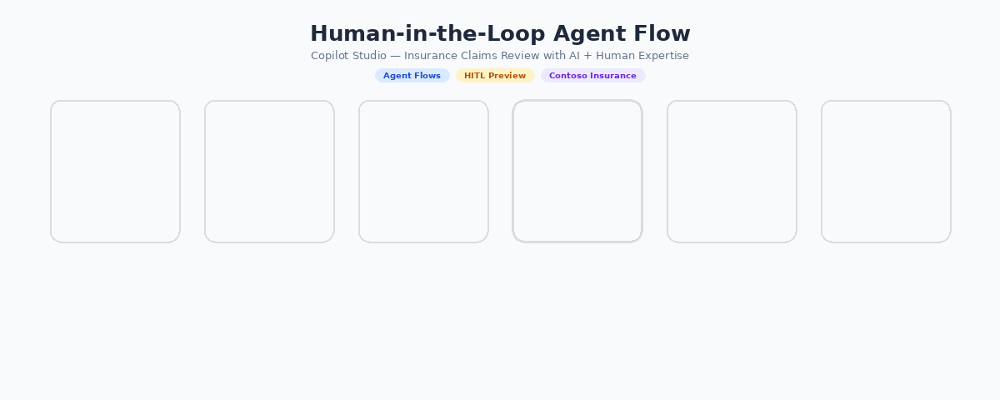

# Copilot Studio Agent Flow

> **Human-in-the-Loop Agent Orchestration for Microsoft Copilot Studio**

Build intelligent workflows where AI agents and humans collaborate seamlessly. Complete orchestration framework with interactive visualizations, enterprise patterns, and production-ready automation for Copilot Studio.

<div align="center">



</div>

---

## 📋 Table of Contents

- [What is Agent Flow?](#-what-is-agent-flow)
- [Quick Start](#-quick-start)
- [Key Features](#-key-features)
- [How It Works](#-how-it-works)
- [Use Cases](#-use-cases)
- [Project Structure](#-project-structure)
- [Implementation Patterns](#-implementation-patterns)
- [Documentation](#-documentation)
- [Enterprise Features](#-enterprise-features)
- [Best Practices](#-best-practices)

---

## 🎯 What is Agent Flow?

Agent Flow is a modern approach to AI automation that seamlessly integrates human judgment with AI capabilities through **Human-in-the-Loop (HITL)** orchestration in Copilot Studio.

**Key Principle:** Critical decisions remain human-controlled while AI handles analysis, recommendations, and routine processing.

### Why Agent Flow?

| Challenge | Solution |
|-----------|----------|
| ❌ Full automation misses edge cases | ✅ Human checkpoints validate AI decisions |
| ❌ Manual processes don't scale | ✅ AI handles routine work efficiently |
| ❌ No audit trail for compliance | ✅ Complete decision logging and traceability |
| ❌ Slow approvals become bottlenecks | ✅ Intelligent routing minimizes wait times |

---

## 🚀 Quick Start

### 1. View the Interactive Visualization

Open the HTML file to explore the complete workflow:

```bash
# Open in browser (Windows)
start visualizations/HITL_Flow_Horizontal.html

# Or open in any web browser
open visualizations/HITL_Flow_Horizontal.html  # macOS
xdg-open visualizations/HITL_Flow_Horizontal.html  # Linux
```

### 2. Explore the Files

```
visualizations/HITL_Flow_Horizontal.html  ← Interactive demo (start here!)
docs/HITL_Agent_Flow_Lab_Guide.pdf  ← Detailed implementation guide
docs/Module_08_Workflow_Designer_HITL.pptx  ← Design patterns & tutorial
samples/data/  ← Test with real data
```

### 3. Next Steps

- 📖 Read the Lab Guide for implementation details
- 🎨 Study the workflow designer presentation
- 🧪 Run through samples with provided datasets
- 🔧 Adapt patterns to your use case

---

## ✨ Key Features

- **🎨 Interactive Flow Visualization** - Beautiful, responsive diagrams showing agent decision paths and human checkpoints
- **👥 Human-in-the-Loop Architecture** - Multi-stage approval workflows with intelligent human oversight
- **🤝 Agent Orchestration** - Coordinate multiple Copilot Studio agents with intelligent routing and decision logic
- **📊 Real-time Status Tracking** - Monitor agent progress, decisions, and human approval points
- **⚙️ Workflow Designer** - Visual tool for designing and customizing HITL workflows
- **🏢 Enterprise Ready** - Audit logging, role-based access, SLA tracking, and compliance features

---

## 📊 How It Works

### The Agent Flow Lifecycle

```
┌─────────────┐
│   REQUEST   │  Input arrives (data, query, task)
└──────┬──────┘
       │
       ▼
┌─────────────────────┐
│   AI PROCESSING     │  Agents analyze, generate recommendations
│   (Copilot Studio)  │  with confidence scores
└──────┬──────────────┘
       │
       ▼
┌──────────────────────┐
│  HUMAN EVALUATION    │  Human reviews AI output
│  • Verify accuracy   │  • Validates context
│  • Check reasoning   │  • Assesses confidence
└──────┬───────────────┘
       │
       ▼
┌──────────────────────┐
│  APPROVAL DECISION   │  ✅ Approve / ❌ Reject / 🔄 Escalate
│  Compliance check    │  Based on risk, policy, rules
└──────┬───────────────┘
       │
       ▼
┌──────────────────────┐
│    EXECUTION         │  Execute approved actions
│    (Copilot Studio)  │  Update systems, send notifications
└──────┬───────────────┘
       │
       ▼
┌──────────────────────┐
│    COMPLETION        │  Return results to requestor
│    + Logging         │  Record all decisions for audit
└──────────────────────┘
```

### Two Common Workflows

**Simple Workflow (Low Risk)**
```
Input → AI Analysis → Auto-Approval → Execute → Complete
```

**Complex Workflow (High Risk)**
```
Input → Multi-Agent Analysis → Human Review → Escalation Routing → 
  ├─ ✅ Approved → Execute → Complete
  ├─ ❌ Rejected → Escalate → Manual Processing
  └─ 🔄 Needs Info → Request Details → Re-Review
```

---

## 💡 Use Cases

### 1️⃣ Insurance Claims Processing
- **Workflow**: Claims submitted → AI screens for fraud/completeness → Human underwriter reviews → Approval/Rejection → Payment processing
- **Impact**: 80% of claims auto-approved, complex cases get expert review

### 2️⃣ Customer Service Escalation
- **Workflow**: Support ticket → Copilot bot attempts resolution → Human escalation if bot confidence < threshold → Resolution
- **Impact**: 60% of tickets resolved by AI, humans handle complex issues

### 3️⃣ Document Verification
- **Workflow**: Documents uploaded → AI extracts data → Human verifies accuracy → Approved for processing
- **Impact**: 90% faster document processing with compliance

### 4️⃣ Financial Transaction Approvals
- **Workflow**: Transaction requested → Algorithms check rules & risk → Flagged transactions → Analyst approval → Execution
- **Impact**: Fraud prevention + fast legitimate transactions

### 5️⃣ HR Workflow Automation
- **Workflow**: Leave request → Policy check → Manager review → Approval → Calendar update
- **Impact**: Consistent policy enforcement with human oversight

---

## 📦 Project Structure

```
📁 copilot-studio-agent-flow/
│
├── 📖 README.md
├── 📄 LICENSE
├── 📄 .gitignore
│
├── 📚 docs/
│   ├─ HITL_Agent_Flow_Lab_Guide.pdf
│   │   └─ Complete implementation guide with patterns
│   ├─ HITL_Agent_Flow_Lab_Guide.docx
│   │   └─ Editable guide for your team
│   └─ Module_08_Workflow_Designer_HITL.pptx
│       └─ Presentation on design patterns & best practices
│
├── 🌐 visualizations/
│   ├─ HITL_Flow_Horizontal.html
│   │   └─ Interactive workflow visualization
│   │      • Real-time animations
│   │      • Decision point visualization
│   │      • Responsive design
│   └─ HITL_Agent_Flow.gif
│       └─ Animated demo for README
│
├── 💾 samples/
│   └─ data/
│       ├─ Contoso_Claims.xlsx
│       ├─ Contoso_Customers.xlsx
│       └─ Contoso_Policies.xlsx
```

---

## 🔧 Implementation Patterns

### Pattern 1: Basic Auto-Approval
**When**: Confidence score > 95%
```
Input → AI Analysis → Confidence Check 
  ├─ High (>95%) → Auto-Execute
  └─ Low (<95%) → Human Review
```

### Pattern 2: Risk-Based Routing
**When**: Risk varies by domain
```
Input → AI Analysis → Risk Score Calculation
  ├─ Low Risk → Auto-Approve
  ├─ Medium Risk → Queue for Review
  └─ High Risk → Urgent Escalation
```

### Pattern 3: Multi-Agent Orchestration
**When**: Complex decisions need multiple perspectives
```
Input → Agent 1 (Analysis) → Agent 2 (Validation) → Agent 3 (Risk Check)
  → Orchestrator (Combine results) → Human Review (if conflicts)
```

### Pattern 4: Feedback Loop
**When**: Improving AI accuracy over time
```
AI Decision → Human Review → Feedback → Model Improvement → Better Decisions
```

---

## 📚 Documentation

| Document | Purpose | Format |
|----------|---------|--------|
| **Lab Guide** | Step-by-step implementation walkthrough | PDF/DOCX |
| **Design Presentation** | workflow patterns, best practices, architecture | PPTX |
| **Sample Datasets** | Real-world scenarios to test workflows | XLSX |
| **HTML Visualization** | Interactive flow diagram | HTML |

**Start Here:** HITL_Agent_Flow_Lab_Guide.pdf

---

## 🏢 Enterprise Features

#### 🔐 Security & Compliance
- ✅ **Audit Logging** - Complete immutable record of all decisions and approvals
- ✅ **Role-Based Access Control** - Agents, reviewers, managers have different permissions
- ✅ **Compliance Ready** - HIPAA, SOX, GDPR compliance patterns included

#### ⚙️ Operations
- ✅ **SLA Management** - Track approval times and identify bottlenecks
- ✅ **Escalation Handling** - Automatic routing when timeouts occur
- ✅ **Performance Metrics** - Real-time dashboards and reporting

#### 🔗 Integration
- ✅ **API Ready** - Integrate with existing business systems
- ✅ **Data Connectors** - Connect to CRM, ERP, databases
- ✅ **Notification System** - Email, Teams, Slack alerts for approvals

---

## 📊 Best Practices

### ✅ Workflow Design
- **Keep approval cycles short** - Minimize human wait times (target: <5 minutes)
- **Provide complete context** - Give reviewers all information they need
- **Set clear thresholds** - Define when AI should auto-approve vs. request review
- **Plan for exceptions** - Design escalation paths for edge cases

### ✅ AI Configuration
- **Start conservative** - Begin with higher confidence thresholds, lower as trust builds
- **Measure accuracy** - Track how often humans agree with AI recommendations
- **Iterate based on feedback** - Improve AI accuracy using human corrections
- **Balance automation** - Automate 70-80% of routine work, keep humans for complex cases

### ✅ Human Oversight
- **Provide clear rationale** - Show why AI made its recommendation
- **Enable quick decisions** - Design UI for fast human review
- **Track reviewer confidence** - Monitor if humans trust the system
- **Regular training** - Keep humans updated on AI capabilities and limitations

### ✅ Compliance & Audit
- **Log everything** - Maintain complete audit trails for regulatory audits
- **Document decisions** - Record who approved what and why
- **Version control** - Track changes to workflow rules and AI models
- **Regular reviews** - Audit logs for compliance and improvement

---

## 🎓 Learning Path

### For Beginners
1. **Day 1**: Open `HITL_Flow_Horizontal.html` - explore the interactive visualization
2. **Day 2**: Read the Lab Guide introduction - understand core concepts
3. **Day 3**: Review sample workflows with provided data
4. **Day 4**: Study one implementation pattern deeply

### For Implementers
1. **Week 1**: Complete Lab Guide + Design Presentation
2. **Week 2**: Define your business workflow and identify decision points
3. **Week 3**: Map to Agent Flow patterns
4. **Week 4**: Build pilot in Copilot Studio
5. **Week 5**: Test with real data and iterate

### For Architects
1. Review all documentation
2. Assess enterprise requirements (audit, compliance, SLA, integration)
3. Design custom patterns for your organization
4. Plan for scale and performance

---

## 📊 Key Metrics to Track

Monitor these KPIs when implementing Agent Flow:

| Metric | Target | Why It Matters |
|--------|--------|-----------------|
| **Automation Rate** | 70-85% | Measures AI effectiveness |
| **Approval Cycle Time** | <5 min | User satisfaction & throughput |
| **Human Agreement Rate** | >90% | Indicates AI trustworthiness |
| **Error/Correction Rate** | <5% | Quality of AI decisions |
| **SLA Compliance** | >95% | Operational health |
| **User Satisfaction** | >4/5 | Adoption and success |

---

## 🤔 FAQ

**Q: Can we achieve 100% automation?**  
A: Generally no. 20-30% of cases have edge cases, conflicts, or exceptional circumstances. Aim for 70-85% automation with intelligent human oversight.

**Q: How long does implementation take?**  
A: Simple workflows: 2-4 weeks. Complex multi-agent: 2-3 months. Start small and expand.

**Q: Does this work with existing Copilot Studio agents?**  
A: Yes! Agent Flow is designed to enhance Copilot Studio. Integrate existing agents into the orchestration framework.

**Q: What about compliance and audit trails?**  
A: Full audit logging is built-in. Complete record of every decision, approval, and human action.

---

## 📞 Support & Resources

**Need Help?**
- 📖 Check the Lab Guide for implementation details
- 🎨 Review the Design Presentation for architecture
- 🧪 Study the sample datasets
- 🌐 Interact with the HTML visualization for visual learning

---

## 📝 License

This project and its documentation are provided as-is for educational and commercial use.

---

<div align="center">

### Built for modern AI-human collaboration

**AI powers the decisions** 🤖 + **Humans provide expertise** 👤 = **Intelligent automation** 🚀

</div>
